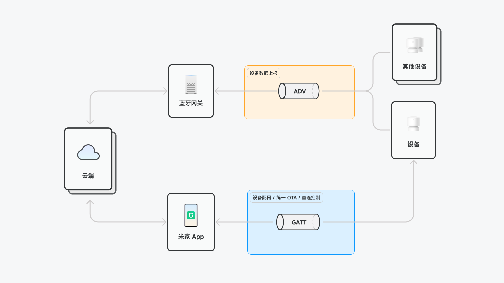
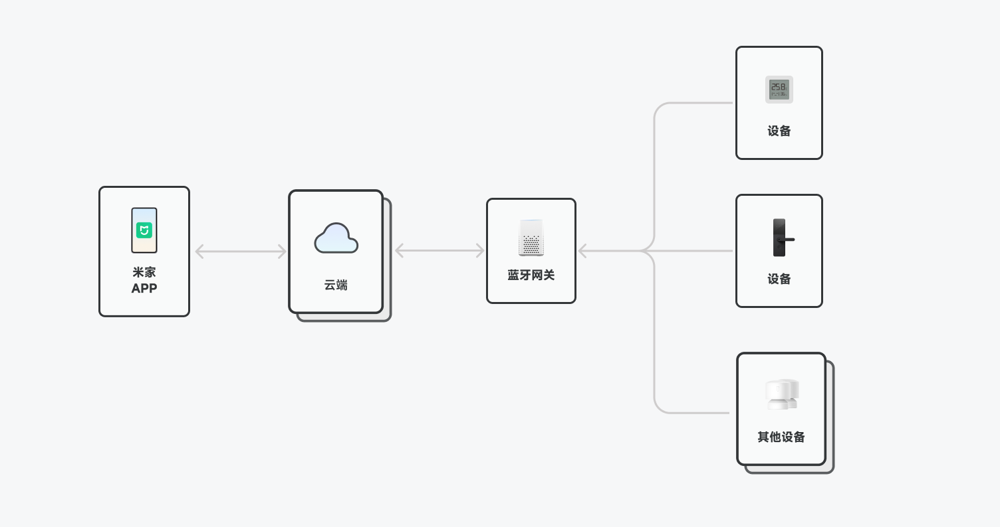
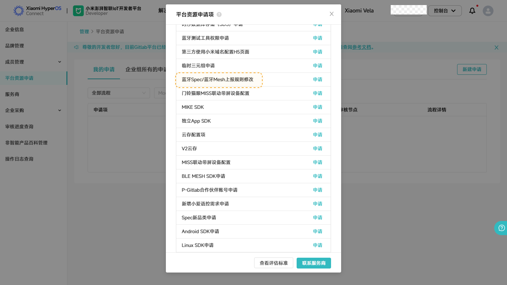
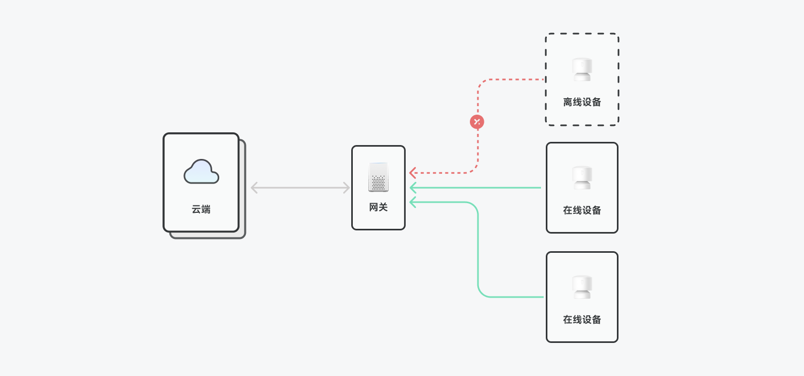
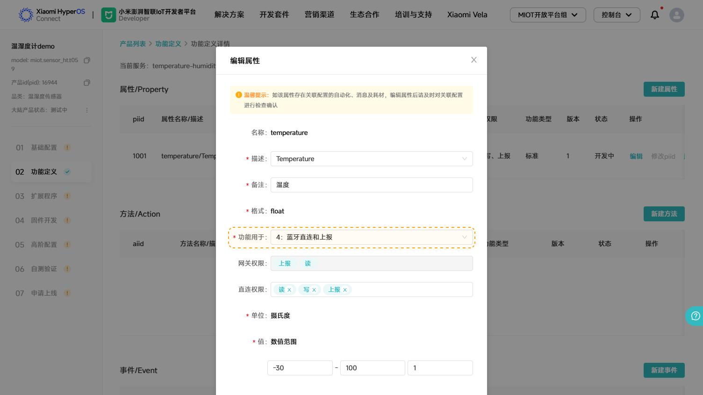

# BLE 基础知识

更新时间：2025/06/23

<!-- caption: 该图展示米家生态中设备通过蓝牙网关与云端通信，支持设备数据上报（ADV）和配网/OTA/直连控制（GATT），用户可通过米家App进行统一管理。 -->

## 米家 BLE 支持的功能

设备配网与 OTA 升级 米家 BLE 提供了标准的基于 GATT(Generic Attribute Profile)直连配网功能，同时集成了模组统一 OTA 功能。开发者无需另行开发模组升级功能，借助 SDK 即可实现设备固件的便捷升级，确保设备功能持续优化与安全性增强，有效降低开发成本与难度，提升设备维护效率。
直连控制与数据交互 支持手机与设备间的直连控制，在局域网环境下，设备不仅能接收控制指令并精准执行操作，还可及时回传状态信息，实现设备与用户间的实时交互，为用户提供流畅、高效的操控体验，满足智能家居场景中对设备即时响应的需求。
网关数据上报 提供了通过网关向云端上报数据的功能与接口。设备可将关键数据经网关上传至云端，以便用户远程获取设备信息，并进行数据分析与管理。该功能增强了设备的远程监控能力，拓展了智能家居应用的范围与深度。

<!-- caption: 该图展示了米家APP通过云端与蓝牙网关连接，进而控制多个智能设备（如温湿度计、门锁及其他设备）的物联网架构，实现远程设备管理与交互。 -->

## 米家 BLE 网络拓扑

说明：
米家 BLE 设备与网关之间是通过广播(ADV)方式发送数据，通过网关只能上报数据，在没有网关时也可根据需要开发蓝牙直连功能控制设备。
BLE 设备通过网关 只能上报 消息，因此也 不支持 小爱下行控制（部分品类可查询）；
为了避免 BLE 设备相同数据未更新时重复上报给服务器，减轻服务器压力，网关设置了设备具备上报权限属性/事件的上报规则 interval（间隔）和 delta（变化量/差值），interval 和 delta 满足任意条件即可上报（如温度传感器每秒持续发送温度为 10℃，若此时 interval==10min，则网关会每间隔 10min 的时候才会上报一次温度到云端）：默认规则不满足产品需求时，可通过 线上申请 修改。

<!-- caption: 该图展示了小米开发者平台“平台资源申请”界面，列出了多项技术资源申请项，如蓝牙Spec修改、SDK申请、云存配置等，供开发者按需提交申请。 -->

<!-- caption: 该图展示了云端通过网关与在线设备进行双向通信，而离线设备则无法连接网关，表明系统支持设备在线状态管理与数据同步机制。 -->

## 米家 BLE 设备在/离线原理

说明： BLE 设备需借助网关向小米 IoT 云端上报设备保活消息，以维持在线状态。
BLE 设备 最长间隔 50min 要广播一次，即上报一次属性/事件，让网关扫描到以此保持在线；
蓝牙 BLE 网关连续 2 小时 都没有为 BLE 子设备上报保活消息，此时 BLE 子设备离线。
## 注意事项

设备最多只支持 7 个具有上报权限的属性/事件，具备上报权限的属性/事件的 IID 大于 1000 。开发者需谨慎选择与配置上报属性 / 事件，确保关键数据及时上传；
只有标准属性/事件才支持上报，如缺少相关标准属性/事件，需要提交“ Spec 新功能或新描述词申请 ”新增；
自定义属性/事件只能用于 GATT 直连通信；
定义支持上报的属性/事件后，设备会默认加入蓝牙网关，无需再申请加入网关；
设备没有通过网关上报的需求只有直连要求时，就不要加载和定义支持上报的功能定义，这样就不会显示在某个网关下且不会显示设备离线。

<!-- caption: 该图展示在小米IoT开发者平台中编辑温湿度传感器属性“temperature”的界面，配置其描述、格式、功能用途、权限及数值范围等参数，用于定义设备上报数据的特性。 -->

米家 BLE 支持的功能
米家 BLE 网络拓扑
米家 BLE 设备在/离线原理
注意事项